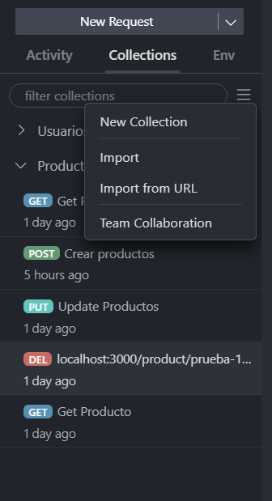

# Backend Haciendola - prueba tecnica

Para poder hacer uso del sistema, debemos tener instalado:

- Node js
- Mysql 

## Preparación de la base de datos 

En la base de datos mysql debemos acceder mediante la terminal con el comando 

```
mysql -u root -p 
```

Nos pedira nuestra contraseña la escribimos, luego crearemos una base de datos con el nombre `haciendola`, accederemos a ella y mediante el archivo database_dump.sql que se encuentra en el siguiente esquema:

```
node_modules/
src/
├── controllers/
├── database/
│   ├── database_dump.sql  <---
│   └── database.js
├── models/
└── routes/
    ├── app.js
    └── index.js
.env
.gitignore
dump.sql
image.png
package-lock.json
package.json
README.md
```

Copiaremos el contenido del archivo dentro de la base de datos.

## Variables env
Lo siguente sera crear un archivo .env en la carpeta en donde este alojado el Backend con la siguiente estructura:

```
PASS=**************
```

Se debe reemplazar el valor de la variable `PASS` con la contraseña de la base de datos mysql local.

## Instalación de dependencias

Ahora procedemos a utilizar el siguiente comando:

```
npm install
```

Con esto instalaremos las depencias del sistema, luego usaremos el comando:

```
npm run dev 
```

Con esto tendremos el Backend/Servidor corriendo a la espera de una solicitud por parte del sistema web. 
Por defecto se esta usando el puerto `3000`.


## Documentación endpoint

Si se necesita se puede ver Documentación de los endpoint creado mediante los archivos:

- thunder-collection_Productos.json
- thunder-collection_Usuarios.json

Estas deben ser importadas en la extensión de Vscode thunder client 


mediante la interfaz de la extension se pueden importar los archivos



Cualquier otra consulta escribir al correo:
---
carlosgaubertquijada@gmail.com