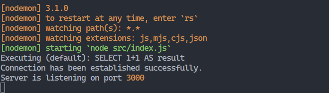

Para poder hacer uso del sistema, debemos tener instalado:

- Node js
- Mysql 

Lo primero que debemos hacer es crear un archivo .env en la carpeta en donde este alojado el Backend con la siguiente estructura:

```
PASS=**************
```

Se debe reemplazar el valor de la variable `PASS` con contraseña de la base de datos mysql local.

Ahora procedemos a utilizar el siguiente comando:

```
npm install
```

Con esto instalaremos las depencias del sistema, luego usaremos el comando:

```
npm run dev 
```

Con esto tendremos el Backend/Servidor corriendo a la espera de una solicitud por parte del sistema web. 
Por defecto se esta usando el puerto `3000` para poder usar este como acceso al Backend, asi no habra problemas con respecto al Frontend y sus solicitudes.


